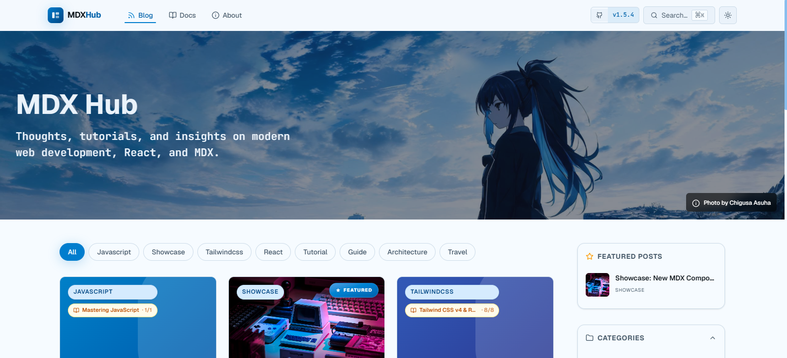

# MDX Hub ✍️



<p align="center">
  <a href="CONTRIBUTING.md">
    
  </a>
  <a href="CODE_OF_CONDUCT.md">
    
  </a>
  <a href="SECURITY.md">
    
  </a>
  <a href="https://app.fossa.com/projects/git%2Bgithub.com%2Fsnap-star%2Fmdxhub?ref=badge_shield&issueType=license" alt="FOSSA Status"></a>
  <a href="https://app.fossa.com/projects/git%2Bgithub.com%2Fsnap-star%2Fmdxhub?ref=badge_shield&issueType=security" alt="FOSSA Status"></a>
</p>

<p align="center">
  <a href="https://react.dev/"></a>
  <a href="https://vitejs.dev/"></a>
  <a href="https://mdxjs.com/"></a>
  <a href="https://tailwindcss.com/"></a>
  <a href="https://reactrouter.com/"></a>
  <a href="https://zustand-demo.pmnd.rs/"></a>
  <a href="https://shiki.style/"></a>
  <a href="https://www.typescriptlang.org/"></a>
  <a href="https://vitest.dev/"></a>
  <a href="https://zod.dev/"></a>
  <a href="https://www.framer.com/motion/"></a>
  <a href="https://katex.org/"></a>
  <a href="https://lucide.dev/"></a>
</p>

A blazingly fast, highly interactive, and beautiful MDX-powered platform for building blogs and documentation sites. Built from the ground up to provide a world-class developer and authoring experience.

**No database required.** Just write your `.md` or `.mdx` files in the `content/` directory, commit them to Git, and let the build system handle the rest.

---

## 🚀 Quick Start

The fastest way to get started with MDXHub is via the scaffolding CLI — no need to clone the entire monorepo:

```bash
# Interactive mode (guided prompts)
npm create mdxhub@latest
# or
pnpm create mdxhub@latest
```

Choose your **template variant** during setup:

| Variant | Description |
|---|---|
| **Full** | Complete site — blog + docs + about page + all features |
| **Blog** | Blog-only site with categories, tags, series, and author pages |
| **Docs** | Documentation-only site with sidebar navigation and section grouping |

### Non-interactive mode (CI / automation)

```bash
npm create mdxhub@latest -- --yes --name my-site --template full --pm pnpm
```

This scaffolds a fully functional MDXHub project in seconds. After scaffolding, run:

```bash
cd my-site
pnpm dev
```

> 💡 **Already an MDXHub user?** The CLI is independently versioned from the platform itself. See [`packages/create-mdxhub`](./packages/create-mdxhub/) for full CLI docs.

---

## ✨ Features

### 📝 Content Authoring

- **Git-Backed CMS**: Write content as Markdown/MDX files right in your editor. Automatically discovered and routed using Vite's `import.meta.glob`. A build-time `content-index.json` powers the blog index, category/tag filters, series navigation, and search — no database needed.
- **Nested Content Routing**: Supports nested folders in `content/blog/**` and `content/docs/**`, with `index.mdx` folder slug support.
- **Relative MDX Assets**: Resolve image sources relative to the current content folder, or use static `/public` assets.
- **Rich MDX Components**: Use React components directly inside your Markdown — globally available, no imports needed.
- **Featured Posts**: Set `featured: true` in frontmatter to highlight posts in the Featured widget on the homepage.
- **Series Support**: Group related posts into series with automatic prev/next navigation, progress bar, and expandable part list.
- **CC License Badges**: Set `cc: "CC-BY-4.0"` in frontmatter to automatically render a Creative Commons license badge in the post footer.
- **Draft System**: Set `draft: true` in frontmatter to exclude posts from the published feed.

### 🔍 Blog Browsing & Discovery

- **Sort & View Controls**: Sort blog posts by Recent or Date Posted, toggle between Ascending/Descending order, and switch between Card and List views — all persisted to localStorage.
- **Blog List View**: A modern horizontal list layout with 70/30 text-to-thumbnail split, segmented pill metadata badges, active hover indicators, and a dedicated chevron block for posts without cover images.
- **Category & Tag Filtering**: Filter blog posts by category or tag, with sidebar widgets, interactive tag clouds, and category filter pills on all blog pages.
- **Persisted Preferences**: Sort mode, sort order, and view preference are saved to localStorage via Zustand persist — your settings survive page reloads and browser restarts.
- **Shareable Blog Controls**: Sort/view/order controls are synced across the main blog index, category pages, and tag pages via a shared `useBlogPosts` hook.

### 🧩 Built-in MDX Components

| Component                                 | Description                                                                                                |
| :---------------------------------------- | :--------------------------------------------------------------------------------------------------------- |
| `<VideoEmbed />`                        | YouTube, Shorts, Vimeo — custom aspect ratios (`16/9`, `4/3`, `1/1`, `9/16`)                      |
| `<Callout />`                           | Admonitions:`note`, `tip`, `info`, `warning`, `danger` — with themed icons                      |
| `<Badge />`                             | Colorful inline pill — 22+ colors, 40+ icons, admonition variants                                         |
| `<Tooltip />`                           | Accessible hover/focus tooltip with placement control (`top`, `bottom`, `left`, `right`)           |
| `<Tabs />`                              | Tabbed content panels —`underline` and `pills` variants, keyboard navigable                           |
| `<Steps />` + `<Step />`              | Numbered step-by-step guides with connecting lines and optional icons                                      |
| `<Mermaid />`                           | Diagram renderer — flowcharts, sequence diagrams, pie charts, class diagrams, and more                    |
| `<CodeSandbox />`                       | Live, editable code sandboxes using Sandpack (React, TypeScript, Vanilla, Static)                          |
| `<Accordion />` + `<AccordionItem />` | Expandable/collapsible sections with `bordered` / `ghost` variants                                     |
| `<CardGrid />` + `<Card />`           | Responsive card grid (1–4 columns) with icons, links, and rich content                                    |
| `<Timeline />` + `<TimelineItem />`   | Chronological timeline with date labels, icons, and color variants (brand, success, warning, danger, info) |
| `<ProfileBadge />`                      | Author profile card for About pages                                                                        |
| `<CCLicense />`                         | One-line Creative Commons badge for any post                                                               |
| `<AuthorCard />`                        | Full author card with avatar, bio, and social links                                                        |

### 🖼️ Media & Rich Content

- **Image Lightbox**: Every image is clickable — opens a full-screen viewer with zoom (25%–400%), rotate, and keyboard (Escape) controls
- **Video Embeds**: YouTube, Shorts, Vimeo — auto-detected and lazy-loaded
- **Mathematical Equations**: Native LaTeX rendering using `remark-math` and KaTeX (inline `$...$` and block `$$...$$`)
- **Image Optimization**: Build-time WebP and AVIF variant generation via Sharp
- **Optimized Images**: `<picture>` elements with automatic format fallbacks

### 🎨 Visual & UX

- **True Syntax Highlighting**: High-fidelity code blocks using [Shiki.js](https://shiki.style/) — Monokai (dark mode), GitHub Light (light mode)
- **Code Block Enhancements**: macOS-style window controls, language label, copy button with checkmark feedback
- **Line Highlighting**: Shiki transformers for diff, highlight, word highlight, and focus annotations
- **Discord-Inspired Dark Theme**: Full OKLCH color palette with brand blue accents
- **Page Transitions**: Fluid Framer Motion `AnimatePresence` transitions with scroll-to-top on navigation
- **Responsive Design**: Mobile-first with dedicated mobile sidebar drawer and bottom TOC sheet

### 🌐 Internationalization (i18n)

- **Multi-Language UI**: Built-in translation system with language switcher in the navbar. Switch between English, Japanese, Bahasa Indonesia — or add your own locale by dropping a JSON file into `src/translations/`.
- **Zustand-Persisted Preference**: Chosen language is saved to localStorage — survives reloads.
- **`useTranslation` Hook**: Simple `t(key, params?)` with `{placeholder}` interpolation and English fallback. Auto-re-renders on locale change.
- **Locale-Aware `<html>`**: The root `lang` attribute updates automatically with the selected language.

### 🔍 Search & Navigation

- **Full-Text Search**: Press `Ctrl+K`/`Cmd+K` anywhere — native `.filter()` search across all blog posts and docs (replaced Fuse.js with zero-cost stdlib alternative)
- **Table of Contents**: Scroll-spy powered by IntersectionObserver, with mobile slide-out sheet
- **Breadcrumbs**: Contextual navigation in blog posts and docs pages
- **Category & Tag Filtering**: Filter blog posts by category or tag, with sidebar widgets and interactive tag clouds
- **Series Navigation**: Inline series badge and prev/next navigation with progress indicator between parts

### 🔗 SEO & Discovery

- **Automatic SEO**: Per-page `og:image`, `twitter:card`, canonical URLs, and meta tags — React 19 auto-hoists `<title>` and `<meta>` to `<head>` (no `react-helmet-async` needed)
- **Sitemap**: Auto-generated `sitemap.xml` with `lastmod` dates from file modification times — served via explicit Vercel rewrite to ensure Google Search Console can read it
- **Robots.txt**: Auto-generated with `Allow: /` and `Sitemap:` directive
- **RSS Feed**: Auto-generated `/rss.xml` with all published blog posts, categories, tags, and author metadata
- **Disqus Comments**: Per-post commenting with comment count badges on cards — with env validation via Zod schema
- **Share Buttons**: Social sharing for every blog post

### ⚡ Performance

- **Lazy-Loaded Heavy Components**: `Mermaid` diagrams and `CodeSandbox` live editors use `React.lazy()` — only download when content actually uses them
- **Dependency Slimdown**: Removed 8 unused/over-engineered deps: `cmdk`, `class-variance-authority`, `gray-matter`, `date-fns`, `fuse.js`, `react-helmet-async`, `@base-ui/react`, `tailwind-merge`, `clsx`
- **Stdlib Replacements**: Replaced `date-fns` → `toLocaleDateString`, `fuse.js` → native `.filter()`, `react-helmet-async` → React 19 auto-hoisting, `@base-ui/react` Tooltip → pure CSS tooltip
- **Consolidated Vendor Chunks**: Small runtime deps merged into single `vendor-misc` chunk to reduce HTTP requests
- **Image Optimization**: Build-time WebP/AVIF generation, lazy loading, and responsive `<picture>` elements
- **Code Splitting**: Manual chunk splitting via `rollupOptions.output.manualChunks` in `vite.config.ts` — see the [Chunk Splitting Reference](#chunk-splitting-reference) below
- **CSS View Transitions**: Native `@view-transition` API for smooth page navigations
- **Lazy Loading**: Images and videos are lazy-loaded by default. The Disqus comment section uses a lazy-loading pattern with `IntersectionObserver` — the embed script is only loaded when the user scrolls near the comments.
- **Over-engineering Cleanup**: Removed Framer Motion page transitions (replaced by CSS `@view-transition`), simplified ErrorBoundary (188→40 lines), simplified NotFound (238→70 lines), section backgrounds → CSS gradients

### 🧪 Testing & Quality

- **Unit Tests**: Vitest + Testing Library for component tests
- **Error Tracking**: Client-side error tracking with context capture
- **Environment Validation**: Zod schema validates all `VITE_*` env vars at startup
- **Content Validation**: Build-time frontmatter schema checks catch missing fields before deploy
- **CI/CD**: GitHub Actions runs type-check → test → build on every push
- **Bundle Analysis**: `pnpm build:analyze` produces interactive bundle visualization

---

## 🚀 Tech Stack

| Layer                         | Technology                                                                              |
| :---------------------------- | :-------------------------------------------------------------------------------------- |
| **Framework**           | [React 19](https://react.dev/)                                                             |
| **Bundler**             | [Vite 8](https://vitejs.dev/) (Rolldown-powered)                                           |
| **Content**             | [MDX v3](https://mdxjs.com/) with `remark-gfm`, `remark-math`, and `rehype-katex`    |
| **Styling**             | [Tailwind CSS v4](https://tailwindcss.com/) (CSS-first architecture, OKLCH color spaces)   |
| **Routing**             | [React Router v8](https://reactrouter.com/) (framework mode, SSG)                          |
| **State Management**    | [Zustand v5](https://zustand-demo.pmnd.rs/) with persistence middleware (`localStorage`) |
| **Syntax Highlighting** | [Shiki v4](https://shiki.style/) (dual-theme, diff/highlight/focus transformers)           |
| **Math Rendering**      | [KaTeX](https://katex.org/)                                                                |
| **Icons**               | [Lucide React](https://lucide.dev/) + [Simple Icons](https://simpleicons.org/)                |
| **Search**              | Native `.filter()` (replaced Fuse.js stdlib)                                          |
| **SEO**                 | React 19 auto-hoisted `<title>`/`<meta>` (replaced `react-helmet-async`)          |
| **Image Processing**    | [Sharp](https://sharp.pixelplumbing.com/)                                                  |
| **Testing**             | [Vitest 4](https://vitest.dev/) + [Testing Library](https://testing-library.com/)             |
| **Env Validation**      | [Zod 4](https://zod.dev/)                                                                  |
| **Language**            | [TypeScript 6](https://www.typescriptlang.org/)                                            |

---

## 📦 Monorepo Development

Want to hack on MDXHub itself? Clone the monorepo:

### Prerequisites

You will need **Node.js 20+** and **pnpm 9+** (or npm 10+) installed on your machine.

### Installation

```bash
git clone https://github.com/snap-star/mdxhub.git
cd mdxhub
pnpm install
```

### Start Development

```bash
pnpm run dev
```

This starts the Vite dev server at [http://localhost:3000](http://localhost:3000). On startup, it automatically generates the content index, RSS feed, and sitemap.

For a smoother experience with instant content-index regeneration, run the watch script in a **separate terminal**:

```bash
# Terminal 1 — Vite dev server with HMR
pnpm run dev

# Terminal 2 — content file watcher (auto-regenerates content-index.json on every save)
pnpm run dev:watch
```

### Production Build

```bash
pnpm run build
```

The build pipeline (orchestrated by `scripts/build.mjs` + `react-router build`):

1. Validates frontmatter schema on all content files (required fields: `title`, `date`, `author`, `category`, `tags`, `description` for blog posts)
2. Generates the content index (`public/content-index.json`) — extracting frontmatter fields including `tags`, `featured`, `series`, `seriesOrder`, `cc` — covering 59+ posts and 13+ docs pages
3. Generates the RSS feed (`public/rss.xml`)
4. Generates the sitemap (`public/sitemap.xml`) and `robots.txt`
5. Generates WebP/AVIF image variants from source images via Sharp
6. Type-checks the project with TypeScript
7. Bundles everything with Vite and pre-renders all routes to static HTML via React Router framework mode into `build/client/`

### Run Tests

```bash
pnpm test          # Run once
pnpm test:watch    # Watch mode
```

### Analyze Bundle

```bash
pnpm build:analyze
```

Preview the build locally:

```bash
pnpm run preview
```

---

## 📂 Project Structure

```text
├── app/                       # React Router framework mode app entry
│   ├── entry.client.tsx       # Client-side hydration entry
│   ├── root.tsx               # Root layout (document shell, providers, HydrateFallback)
│   └── routes.ts              # Route definitions (flat file convention)
├── content/                    # Your Markdown/MDX content lives here
│   ├── blog/                  # Blog posts (auto-routed to /blog/*)
│   │   ├── react-19-complete-*/   # 30-part React 19 series
│   │   ├── tailwindcss-v4/        # 5-part Tailwind CSS v4 series
│   │   ├── trpc-zod/              # tRPC + Zod series
│   │   ├── zustand/               # Zustand series
│   │   └── *.mdx                  # Standalone posts
│   ├── docs/                  # Documentation pages (auto-routed to /docs/*)
│   │   ├── 1-introduction/
│   │   ├── 2-guides/
│   │   ├── 3-deployment/
│   │   ├── 4-troubleshooting/
│   │   ├── 5-author/
│   │   └── 6-project-status/
│   ├── authors/
│   │   └── authors.yaml      # Author profiles registry
│   └── about.mdx              # Rendered at /about
├── public/                    # Static assets served at root
│   ├── rss.xml               # Auto-generated RSS feed (generated at build time)
│   ├── sitemap.xml            # Auto-generated sitemap (generated at build time)
│   ├── robots.txt             # Auto-generated robots.txt (generated at build time)
│   └── ...                    # Images, icons, etc.
├── scripts/
│   ├── build.mjs                     # Build orchestrator (index → RSS → sitemap → images)
│   ├── build-analyze.cjs             # Bundle analysis wrapper
│   ├── generate-content-index.cjs    # Builds content-index.json from frontmatter (+ validation)
│   ├── generate-image-variants.cjs   # WebP/AVIF generation
│   ├── generate-rss.cjs              # RSS feed generation
│   ├── generate-sitemap.cjs          # Sitemap + robots.txt generation
│   ├── helpers.cjs                   # Shared walk() + escapeXml() for build scripts
│   └── watch-content.cjs             # Dev file watcher (auto-regenerates on save)
├── src/
│   ├── components/
│   │   ├── blog/             # Blog-specific components (PostCard, PostListView, CategoryFilter, TOC, Breadcrumbs, etc.)
│   │   ├── docs/             # Docs-specific components (Sidebar, PrevNextNav, etc.)
│   │   ├── mdx/              # Global MDX components (Callout, VideoEmbed, Badge, Timeline, etc.)
│   │   ├── common/           # Shared components (Navbar, Footer, SEO, ThemeToggle, LanguageSwitcher, ErrorBoundary, NotFound)
│   │   └── search/           # Search command palette (Cmd+K)
│   ├── hooks/                # Shared React hooks (useBlogPosts, useActiveHeading, useContentHeadings, useTranslation)
│   ├── layouts/              # BlogLayout, DocsLayout
│   ├── routes/               # React Router page definitions
│   ├── lib/                  # Utilities, content types, remark plugins, analytics, error tracking
│   ├── store/                # Zustand stores (blogPrefs, content, navigation, theme, translation)
│   ├── translations/         # Translation JSON files (en.json, ja.json, id.json)
│   ├── config/               # Environment validation (env.ts, Zod schema)
│   ├── test/                 # Vitest setup and test files
│   └── styles/               # Blog and docs theme overrides
├── react-router.config.ts    # React Router framework config (SPA mode + prerender routes)
├── site.config.json          # GitHub URL configuration
├── vercel.json               # Vercel SSG rewrites + static file overrides
└── package.json              # Project dependencies and scripts
```

---

## 🧭 Routing (React Router v8 Framework Mode)

Routes are defined in `app/routes.ts` using flat file conventions. The route loader in `react-router.config.ts` pre-renders all known content paths at build time.

### Content-to-Route Mapping

- `content/about.mdx` → `/about`
- `content/docs/**/*.{md,mdx}` → `/docs/*`
- `content/blog/**/*.{md,mdx}` → `/blog/*`
- `content/blog/**/index.mdx` → `/blog/**` (folder slug)
- `content/docs/**/index.mdx` → `/docs/**` (folder slug)

### Valid Routes

| Path                     | Source                                                       |
| :----------------------- | :----------------------------------------------------------- |
| `/`                    | Home page (hero, features, component showcase, latest posts) |
| `/about`               | `content/about.mdx`                                        |
| `/blog`                | Blog index (all posts) with sort/view/order controls         |
| `/blog/:slug`          | Individual blog post                                         |
| `/blog/category/:name` | Filtered by category (with sort/view/order controls)         |
| `/blog/tag/:tag`       | Filtered by tag (with sort/view/order controls)              |
| `/docs`                | Docs landing page                                            |
| `/docs/:section/:slug` | Individual doc page                                          |
| `/search`              | Full-text search page with grouped results                   |

### Invalid Routes

- `/about/me` — only `/about` is supported for the standalone about page
- `/docs/about` — docs pages must live under `content/docs/`
- `/content/docs/guides/installation` — URLs do not include the `content/` prefix

---

## 📝 Authoring Content

### Blog Post Frontmatter

```yaml
---
title: "My Awesome Post"
date: "2026-06-21"
author: "chigusa-asuha"       # Must match an id in content/authors/authors.yaml
category: "Tutorial"
tags: ["react", "mdx", "vite"] # Array — inline ["a","b"] or indented list both work
description: "A short summary for the post card and SEO meta description."
coverImage: "https://..."    # Thumbnail and Open Graph image
featured: true                # Optional — highlights in featured posts widget with red flame badge
cc: "CC-BY-4.0"              # Optional — Creative Commons license badge in footer
series: "My Series Name"     # Optional — groups related posts with series navigation
seriesOrder: 1                # Optional — sort order within a series
draft: false                  # Optional — hides from feed when true
readingTime: 5                # Optional — override auto-calculated reading time
order: 1                      # Optional — manual sort order for pinned posts
---
```

### Doc Page Frontmatter

```yaml
---
title: "Getting Started"
section: "Introduction"       # Section name shown in sidebar
order: 1                      # Sort order within section
description: "Learn how to…"
version: "v1.0"              # Optional version badge
draft: false
toc: true                     # Enable table of contents (default: true)
---
```

Blog slugs are derived from the file path. Files under `content/blog/**` map to `/blog/...`, and `index.mdx` inside a folder maps to the folder slug.

For more detailed information, check out the [Creating Posts Guide](/blog/creating-posts-guide) once the dev server is running.

---

## 🧩 Chunk Splitting Reference

The Vite build configuration uses `manualChunks` to split large third-party dependencies into dedicated vendor bundles. This improves caching — if one dependency changes, the others keep their browser cache — and reduces the initial load size by deferring less-frequently-used code.

The following vendor chunks are created at build time:

| Chunk Name          | Contents                                                          | Rationale                                                                                                |
| :------------------ | :---------------------------------------------------------------- | :------------------------------------------------------------------------------------------------------- |
| `vendor-react`    | `react`, `react-dom`, `react-router`, `scheduler`         | Core framework — always loaded, always cached                                                           |
| `vendor-framer`   | `framer-motion`                                                 | ~130KB animation library — only on pages with animations                                                |
| `vendor-shiki`    | `shiki`, `@shikijs/*`                                         | Syntax highlighting grammars and themes — only when showing code blocks                                 |
| `vendor-katex`    | `katex`                                                         | Math rendering engine (includes CSS + fonts) — only on posts with LaTeX                                 |
| `vendor-icons`    | `lucide-react`                                                  | Icon library — accumulates across many icon imports                                                     |
| `vendor-sandpack` | `@codesandbox/sandpack-react`, `@codesandbox/sandpack-client` | In-browser code sandbox (bundler, editor, preview) — lazy-loaded, only on pages with live code examples |
| `vendor-misc`     | `zustand`                                                       | Persisted state management                                                                               |

Additionally, `Mermaid` and `CodeSandbox` are `React.lazy()` loaded — their heavy dependencies only download when a content page actually uses them.

### How to add a new chunk

Add an `if` clause inside the `manualChunks` function before the implicit fall-through:

```ts
// Example: add a vendor chunk for a charting library
if (id.includes('node_modules/recharts')) {
  return 'vendor-charts'
}
```

The order matters — the first matching `if` wins. Place more-specific matches before less-specific ones.

---

## 🔧 Scripts Reference

| Command                             | Description                                                                            |
| :---------------------------------- | :------------------------------------------------------------------------------------- |
| `pnpm run dev`                    | Start dev server (runs prebuild steps then Vite)                                       |
| `pnpm run dev:watch`              | Watch `content/` for changes — auto-regenerates content-index, RSS, sitemap on save |
| `pnpm run build`                  | Prebuild steps → type-check → production build                                       |
| `pnpm run build:analyze`          | Build with interactive bundle visualization                                            |
| `pnpm run preview`                | Serve the production build locally                                                     |
| `pnpm run test`                   | Run tests once (Vitest)                                                                |
| `pnpm run test:watch`             | Run tests in watch mode                                                                |
| `pnpm run lint`                   | Run ESLint on all source files                                                         |
| `pnpm run generate:content-index` | Regenerate content-index only (via `scripts/build.mjs`)                              |

### Build Pipeline

The build pipeline runs `scripts/build.mjs` (prebuild steps) then `react-router build` (Vite bundling + route prerendering):

1. **`scripts/generate-content-index.cjs`** — Validates frontmatter schema, scans all `.md`/`.mdx` files, extracts YAML frontmatter (including `tags`, `featured`, `series`, `seriesOrder`, `cc`), and outputs `public/content-index.json` and `public/content-slug-map.json`
2. **`scripts/generate-rss.cjs`** — Generates `public/rss.xml` from all published blog posts
3. **`scripts/generate-sitemap.cjs`** — Generates `public/sitemap.xml` and `public/robots.txt`
4. **`scripts/generate-image-variants.cjs`** — Generates WebP and AVIF variants of all content images using Sharp
5. **`react-router build`** — Bundles with Vite (via `@react-router/dev`), pre-renders all routes to static HTML using `react-router.config.ts`'s `prerender()` function

---

## 🌐 Configuration

### Site Config

Edit `site.config.json` at the project root:

```json
{
  "githubUrl": "https://github.com/snap-star/mdxhub"
}
```

### Authors Registry

Register authors in `content/authors/authors.yaml`:

```yaml
- id: chigusa-asuha
  name: "Chigusa Asuha"
  avatar: "/snap-star.png"
  bio: "Lead Developer & Creative Technologist."
  github: snap-star
  website: https://mdxhub.vercel.app/
```

### SEO Configuration

SEO metadata (site URL, title, description, Open Graph defaults) is configured in `src/components/common/SEO.tsx`. The site URL is currently set to `https://mdxhub.vercel.app` — update this before deploying to a custom domain.

### Environment Variables

Required variables are validated at startup via a Zod schema in `src/config/env.ts`. Copy `.env.example` to `.env.local` and fill in:

| Variable                    | Required | Description                         |
| :-------------------------- | :------: | :---------------------------------- |
| `VITE_SITE_URL`           |   Yes   | Canonical site URL                  |
| `VITE_DISQUS_SHORTNAME`   |    No    | Disqus forum shortname for comments |
| `VITE_ANALYTICS_ID`       |    No    | Analytics tracking ID               |
| `VITE_GITHUB_TOKEN`       |    No    | GitHub API token for issue creation |
| `VITE_ERROR_TRACKING_DSN` |    No    | Error reporting endpoint            |

---

## 🚢 Deployment

This project uses **React Router v8 framework mode** with **SPA mode + SSG prerendering**. All routes are pre-rendered to static HTML at build time, then hydrated client-side. Deploy to any static host:

### Vercel (Recommended)

The included `vercel.json` handles SSG routing with explicit static file overrides and Content-Type headers. The React Router build generates a `__spa-fallback.html` for unmatched routes (deep links, bookmarks).

1. Push to GitHub (CI runs type-check → test → build automatically via GitHub Actions)
2. Import to Vercel (framework preset: `Vite`, output directory: `build/client`)
3. Done

### Netlify

Add a `public/_redirects` file or `netlify.toml` with:

```
/*    /__spa-fallback.html   200
```

---

## 📜 License

MIT License. Created with ❤️ by [snap-star](https://github.com/snap-star).


[](https://app.fossa.com/projects/git%2Bgithub.com%2Fsnap-star%2Fmdxhub?ref=badge_large&issueType=license)
