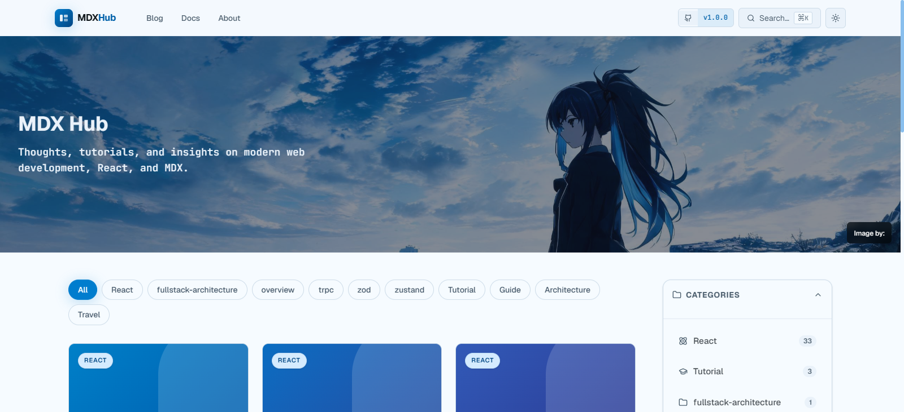

# Welcome to MDX

MDX allows you to use JSX in your markdown content. You can import components, such as interactive charts or alerts, and embed them within your content. This makes writing long-form content with interactive elements a breeze.

## Why MDX?

Markdown is great, but it's limited to static content. MDX bridges the gap between structured content and interactive components.

<Callout type="tip" title="Pro Tip">
  Use the `rehype-slug` and `rehype-autolink-headings` plugins to automatically generate anchor links for all your headings!
</Callout>

## Code Examples

Here is a standard code block, highlighting handled automatically by Shiki at build time. Note the custom Diff transformers support in our configuration.

```typescript
// vite.config.ts
import { defineConfig } from 'vite'
import mdx from '@mdx-js/rollup'

export default defineConfig({
  plugins: [
    {
      enforce: 'pre', // [!code highlight]
      ...mdx()
    }
  ]
})
```

### Supported Languages

Shiki supports hundreds of languages. Here's a quick Rust example:

```rust
fn main() {
    println!("Hello from MDX!");
}
```

## Adding Footnotes

You can add footnotes to your MDX content using standard markdown syntax.[^1]

[^1]: This is the footnote text that will be rendered at the bottom of the page.
